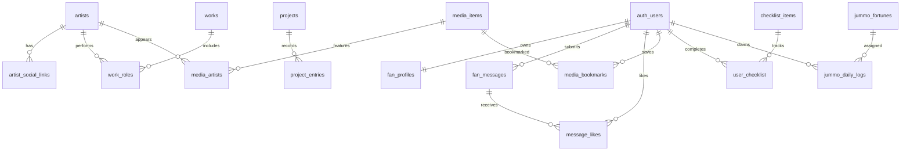

# Database JuniorMark

## Đã tạo trên máy này

- Database: `juniormark`
- Server: PostgreSQL 14.5, `127.0.0.1`
- Port: `55432` (instance riêng, không thay đổi PostgreSQL/MySQL khác của Laragon)
- Username local: `postgres`
- Password local: xem file `.local/postgres-password.local` trong dự án. Không commit hoặc đưa vào React.
- Dữ liệu bền vững: `.local/postgres/`, đã loại khỏi Git.
- 24 bảng nghiệp vụ trong schema `public`; 3 bảng nội bộ trong `private`.

Dùng thông số trên trong pgAdmin hoặc HeidiSQL có hỗ trợ PostgreSQL. Database local có các schema tương thích tối thiểu `auth` và `storage` để chạy migrations; **không phải một Supabase server**. Đăng ký email, OAuth, REST API, upload và realtime chưa chạy chỉ bằng database này. Frontend hiện chưa nối catalog mới.

Trong PowerShell tại thư mục dự án:

```powershell
./scripts/database-local.ps1 -Action status
./scripts/database-local.ps1 -Action start
./scripts/database-local.ps1 -Action verify
./scripts/database-local.ps1 -Action stop
```

Không cần bật MySQL để dùng database này. Server không tự chạy lại sau khi khởi động Windows; dùng `start`. `create` dành cho máy chưa có database; nếu database đã tồn tại, script giữ nguyên và không chạy lại migration.

## Đối chiếu tài liệu Word, mục IV.2

| Nhóm trong Word | Bảng triển khai | Giải thích |
| --- | --- | --- |
| `users` | `auth.users`, `fan_profiles`, `private.staff` | Auth giữ tài khoản/email/mật khẩu; fan sửa tên/avatar; quyền quản trị không cho người dùng tự sửa |
| `profiles` | `artists`, `artist_social_links` | Hồ sơ Junior/Mark/Jummo; họ tên Anh/Thái, nickname, ngày sinh, tiểu sử, ảnh, social links |
| `media_items` | `media_items`, `media_artists` | Ảnh/video, thumbnail, credit, nguồn, tags, người xuất hiện |
| `schedules` | `events` | Lịch, giờ bắt đầu/kết thúc, địa điểm, map, livestream, hashtags, nguồn xác nhận |
| `fan_stars` | `fan_messages` với `kind='star'` | Dùng chung cơ chế với lời nhắn `kind='note'`; tọa độ sao lưu cố định; bài mới chờ duyệt |
| `jummo_fortunes` | `jummo_fortunes` | Nội dung quẻ và hình nền |
| `jummo_daily_logs` | `jummo_daily_logs` | Một tài khoản/một ngày; ngày do DB tính theo giờ Việt Nam |
| `jummo_secret_rewards` | `jummo_secret_rewards` | Thư, video, wallpaper, sticker mở qua Easter Egg |

Tên bảng/trường là tiếng Anh dạng `snake_case`. Giữ các tên `fan_profiles`, `artists`, `events`, `fan_messages` đã dùng trong code; không tạo bảng trùng dữ liệu chỉ để đổi tên. Các tên cũ ngắn như `body` nghĩa là nội dung, `kind` là loại, `spectrum` là nhân vật Junior/Mark/Jummo được chọn.

Các bổ sung từ UI: `works`/`work_roles` (phim/vai diễn/timeline), `tracks` (âm nhạc), `projects`/`project_entries` (dự án/quỹ), `editorial_entries` (nội dung biên tập), `glossary`/`checklist_items`/`quiz_questions` (cẩm nang), `downloads` (tài nguyên tải), `message_likes`, `media_bookmarks`, `user_checklist`, `fan_progress`.

Ngày sinh lưu một lần ở `artists.birthday`; tuổi/countdown tự tính. Tổng tiền và phần trăm quỹ tính từ bút toán, lượt thích tính từ `message_likes`. Theme, animation, tab, bộ lọc, modal và số lần chạm Jummo giữ ở frontend. Xem đầy đủ cột/kiểu dữ liệu trong [database-fields.md](database-fields.md).

## Tạo Supabase online sau này

1. Tạo dự án Supabase tên `juniormark` (database hệ thống của Supabase thường có tên `postgres`; không đổi tên đó).
2. Trên dự án **trống**, chạy `supabase/setup.sql` trong SQL Editor. File đã gộp 001–005 và seed; không chạy thêm từng migration một lần nữa.
3. Nếu đã chạy 001/002 trước đây, chỉ chạy migration còn thiếu theo thứ tự, sau đó `seed.sql`. Không chạy lại `setup.sql` trên database đang có schema.
4. Không chạy `scripts/local-supabase-compat.sql` trên Supabase: Auth/Storage thật đã do Supabase cung cấp.
5. Điền URL và publishable key vào `.env.local` theo `.env.example`. Không đưa mật khẩu DB/service_role vào frontend.

Seed chỉ thêm bản ghi chưa có, không ghi đè nội dung đã sửa. Lịch/quỹ có `is_demo=true`, không phải sự kiện hay tiền đóng góp thật. Quẻ/thư mẫu do fansite biên soạn, không phải lời phát ngôn của nghệ sĩ. Họ tên Thái/social links chưa xác minh để trống, không bịa nội dung.

## Quản trị và quyền

Khách đọc nội dung `published` và lời nhắn `approved`. Fan chỉ sửa dữ liệu của mình. `editor` sửa/xuất bản nội dung; `moderator` duyệt lời nhắn; `admin` có cả hai quyền. Cấp quyền trong SQL Editor bằng UUID của tài khoản đã đăng ký (thay UUID ví dụ trước khi chạy):

```sql
insert into private.staff (user_id, role)
values ('00000000-0000-0000-0000-000000000000', 'admin')
on conflict (user_id) do update set role = excluded.role;
```

Frontend gọi `get_catalog()` để đọc nội dung; `get_message_feed()`/`get_community_stats()` để đọc cộng đồng; `moderate_message()` để duyệt; `claim_daily_fortune()` để nhận quẻ. Các hàm vẫn kiểm tra quyền trong database. Không tự ghi trực tiếp vào `jummo_daily_logs`.

Bucket `site-media` chỉ dùng file được phép công khai; `editorial-drafts` giữ file nháp riêng. Tên "secret reward" chỉ là cách mở Easter Egg, không phải cơ chế bảo vệ tài liệu mật. `media_items.view_count` chưa nối bộ đếm từ UI.

## Kiểm tra và tái tạo SQL

```text
npm run db:seed
npm run db:bundle
npm run test:db
```

38 kiểm tra trên PostgreSQL PGlite đã qua, gồm phân quyền, chống tự duyệt, dữ liệu riêng, lượt thích không trùng, giới hạn gửi kể cả sau khi xóa bài, và một quẻ/ngày. Migrations/seed cũng đã chạy trên PostgreSQL 14.5 thật tại máy này. Chưa kiểm thử dịch vụ Supabase online.

## Quan hệ chính



`auth_users` trong sơ đồ là `auth.users` của Supabase.
